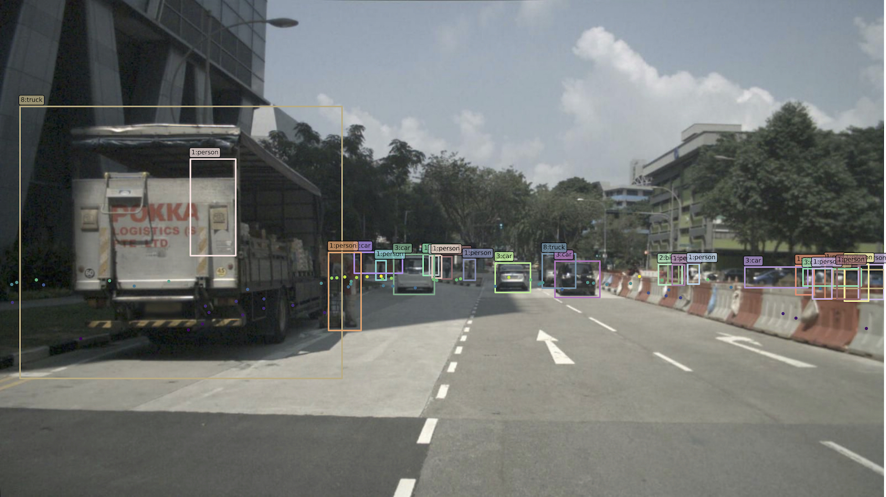
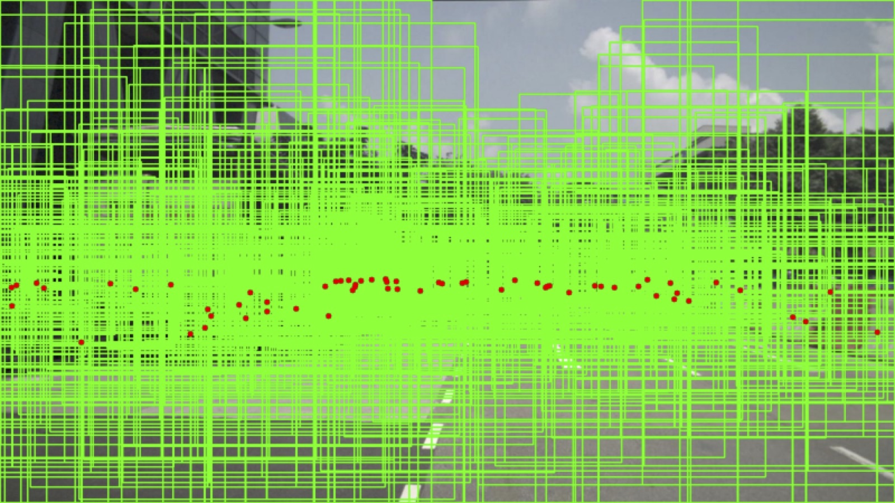
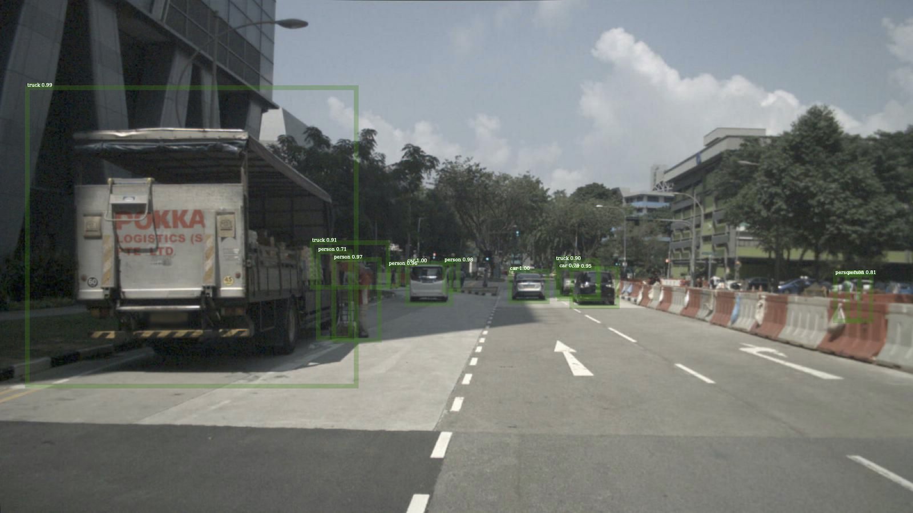

# RRPN: Radar Region Proposal Network for Sensor Fusion in Autonomous Vehicles

## Introduction


| |  | 
|- | - | -|

RRPN is a Region Proposal Network (RPN) exploiting Radar detections to propose
Regions of Interest (RoI) for object detection in autonomous vehicles. RRPN provides
real-time RoIs for any two-stage object detection network while achieving precision
and recall values higher than or on par with vision based RPNs. We evaluate RRPN
using the [Fast R-CNN](https://arxiv.org/abs/1504.08083) network on the
[NuScenes](https://www.nuscenes.org/) dataset and compare the results with the
[Selective Search](https://ivi.fnwi.uva.nl/isis/publications/2013/UijlingsIJCV2013/UijlingsIJCV2013.pdf)
algorithm.


> This project has been updated to work with the full nuScenes dataset (v1.0).
> The results reported in the paper are based on the Teaser version of the 
> nuScenes dataset (v0.1), which is now deprecated.

#### Links:
[[RRPN on arXive](https://arxiv.org/abs/1905.00526)] - [[RRPN on IEEE Explore](https://ieeexplore.ieee.org/abstract/document/8803392)]

## Contents

1. [Requirements](#requirements)
2. [Installation](#installation)
3. [Training](#training)
4. [Evaluation and Inference](#evaluation-and-inference)
--------------------------------------------------------------------------------
## Requirements

- Python3.7
- Caffe2 with GPU support
--------------------------------------------------------------------------------
## Installation

- Clone the repo and install the prerequisites:

  ```bash
  cd ~
  clone https://github.com/mrnabati/RRPN
  cd rrpn
  python -m pip install -r requirements.txt
  ```

- Set up Detectron Python modules:

  ```bash
  cd ~/rrpn/detectron 
  make
  ```

- Download the NeScenes dataset from its [Download Page](https://www.nuscenes.org/download), 
  unpack the archive files to `~/rrpn/data/nuscenes/` _without_
  overwriting folders that occur in multiple archives. Eventually you should
  have the following folder structure:

  ```
  nuscenes
    |__ maps
    |__ samples
    |__ sweeps
    |__ v1.0-mini
    |__ v1.0-test
    |__ v1.0-trainval
  ```

--------------------------------------------------------------------------------
## Training
- First convert the nuScenes dataset to the COCO format by running the `0_nuscenes_to_coco.sh`
script under [experiments](./experiments/) for both training and validation sets.
This should result in the following folder structure in the `~/rrpn/data/nucoco` directory:

  ```
  nucoco
    |__ annotations
    |   |__ instances_train.json
    |   |__ instances_val.json
    |
    |__ train
    |   |__ 00000001.jpg
    |   |__ ...
    |__ val
        |__ 00000001.jpg
        |__ ...
  ```

- Generate proposals for the training and validation splits by running the `1_generate_proposals.sh` script. This should add an `proposals` directory in the 
above structure:

  ```
  nucoco
    |__ annotations
    |   |__ instances_train.json
    |   |__ instances_val.json
    |
    |__ proposals
    |   |__ proposals_train.pkl
    |   |__ proposals_val.pkl
    |
    |__ train
    |   |__ 00000001.jpg
    |   |__ ...
    |__ val
        |__ 00000001.jpg
        |__ ...
  ```

- Start training by running the `2_train.sh` script. Change the config file and 
other parameters in the script as you wish. If you don't want to train from 
scratch, download the pre-trained Fast-RCNN model based on your
selected config file from the [Detectron Model Zoo](https://github.com/facebookresearch/Detectron/blob/master/MODEL_ZOO.md) and fine-tune it on the nuScenes dataset.

--------------------------------------------------------------------------------
## Evaluation and Inference
- Run the `3_test.sh` script in the [experiments](./experiments/) directory to evaluate the trained model on the whole validation set and see the evaluation statistics. Make sure to change the parameters in the script to select the model, config file and dataset you want to evaluate on.
- Run the `4_inference.sh` script to perform inference on a single image from the dataset.

--------------------------------------------------------------------------------
## Citing RRPN
If you find RRPN useful in your research, please consider citing.
```
@inproceedings{nabati2019rrpn,
  title={RRPN: Radar Region Proposal Network for Object Detection in Autonomous Vehicles},
  author={Nabati, Ramin and Qi, Hairong},
  booktitle={2019 IEEE International Conference on Image Processing (ICIP)},
  pages={3093--3097},
  year={2019},
  organization={IEEE}
}
```